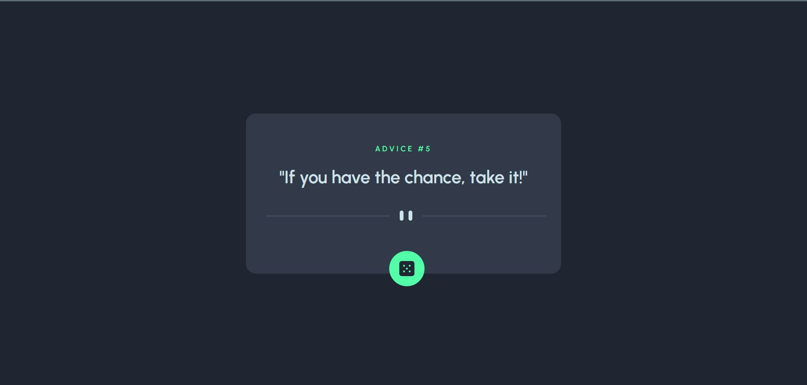

# Frontend Mentor - Advice generator app solution

This is a solution to the [Advice generator app challenge on Frontend Mentor](https://www.frontendmentor.io/challenges/advice-generator-app-QdUG-13db). Frontend Mentor challenges help you improve your coding skills by building realistic projects.

## Table of contents

- [Overview](#overview)
  - [The challenge](#the-challenge)
  - [Screenshot](#screenshot)
  - [Links](#links)
  - [Built with](#built-with)
  - [What I learned](#what-i-learned)
  - [Useful resources](#useful-resources)
- [Author](#author)
- [Acknowledgments](#acknowledgments)


## Overview

This is my second challenge from frontendmentor.io , it is a very good website to brush up your skills, you can use any tools you want to complete this project . This application was developed using reactJs , Axios  and tailwind-css.
It is a level 2 challenge.

### The challenge

Users should be able to:

- View the optimal layout for the app depending on their device's screen size
- See hover states for all interactive elements on the page
- Generate a new piece of advice by clicking the dice icon

### Screenshot



### Links

- Solution URL: [Github](https://github.com/DhairyaSehgal07/AdviceGenerator07)
- Live Site URL: [Advice-generator07](https://advice-generator07.netlify.app/)


### Built with

- Semantic HTML5 markup
- CSS custom properties
- Flexbox
- [Axios](https://axios-http.com/docs/intro)-Promise based http client
- [React](https://reactjs.org/) - JS library
- [Tailwind css](https://tailwindcss.com/) - For styles


### What I learned

Through this project, i got to learn how to use Axios , to fetch data from an API and React's useState and useEffect hooks.It was a really good learning experience for me overall.


```React code
   useEffect(() => {
        axios
            .get('https://api.adviceslip.com/advice')
            .then((res) => {
                setData(res.data); 
            });
               
    }, []);
```


### Useful resources

- [React dev docs](https://react.dev/) - This helped me to gain an understanding of react hooks 
- -[Axios docs](https://axios-http.com/docs/api_intro) This is a very helpful article which helped me understand the working of Axios api and helped me with it's syntax
- [Tailwind css docs](https://tailwindcss.com/) - This is an amazing article which helped me find the suitable styles for my components.It also helped me with the syntax of tailwind css


## Author

- Website - [Dhairya Sehgal](https://dhairya-sehgal-portfolio.netlify.app/)
- Frontend Mentor - [@DhairyaSehgal07](https://www.frontendmentor.io/profile/DhairyaSehgal07)


